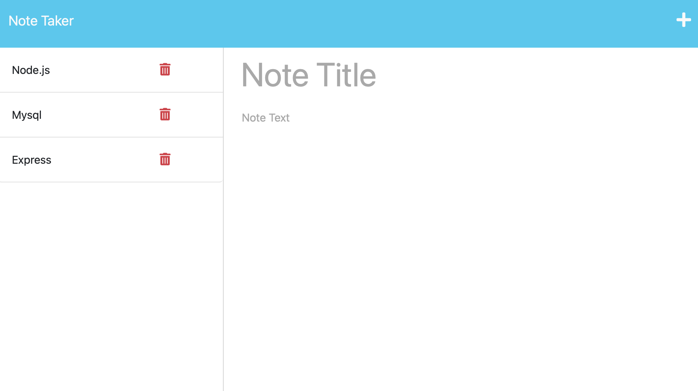

# Note-Taker-Assistant

## Description

This is a simple note-taking application designed to assist small business owners in organizing their thoughts and keeping track of tasks. Users can write and save notes, view existing notes, and delete notes if the Bonus functionality is implemented.

## Mock-Up

Existing notes are listed in the left-hand column with empty fields on the right-hand side for the new note's title and text.

## Getting Started

To run the Note-Taker application, follow these steps:

1. Make sure you have Node.js installed on your computer.
2. Clone this repository to your local machine.
3. Navigate to the project directory in the terminal.
4. Install the required dependencies by running the following command:

>npm install

5. Create a `db.json` file on the back end to store and retrieve notes using the fs module.
6. Create the following HTML routes:
- GET `/notes` should return the `notes.html` file.
- GET `*` should return the `index.html` file.
7. Create the following API routes:
- GET `/api/notes` should read the `db.json` file and return all saved notes as JSON.
- POST `/api/notes` should receive a new note to save on the request body, add it to the `db.json` file, and then return the new note to the client. You'll need to find a way to give each note a unique ID when it's saved (look into npm packages that could do this for you).

## Deployment

To deploy the Note-Taker application to Heroku, follow these steps:

1. Create a Heroku account if you don't have one.
2. Install the Heroku CLI on your computer.
3. Log in to your Heroku account using the CLI:

>heroku login

4. In the project directory, create a `Procfile` with the following content:

>web: node server.js

5. Commit any changes and push the code to a GitHub repository.
6. Create a new Heroku app using the CLI:

>heroku create your-app-name

7. Deploy the app to Heroku:

>git push heroku main

8. Once the deployment is successful, you can open the app in your browser using the Heroku app URL.

## Technical Acceptance Criteria

- The application front end must connect to an Express.js back end.
- The application back end must store notes with unique IDs in a JSON file.
- The application must be deployed to Heroku.

## Credits

- Collaborated with cohort Leveraged partnerships to check for understanding.
Credits
- Referenced Modzilla Web Development Blog and Code Source for additional guidance.
- Tutor and Chat GPT validated code and help finalize after troubleshooting.

## License

This project is licensed under the terms of the MIT License. See the [LICENSE](LICENSE) file for details.

## Contributers

---

Thank you for using the Note-Taker application! We hope it helps you stay organized and productive in managing your life and small business. Happy note-taking!

